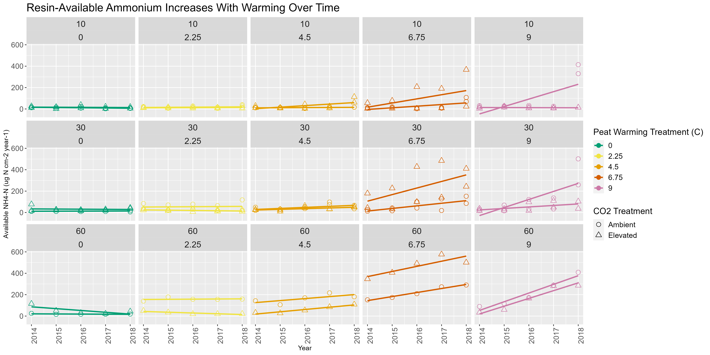

# HMWK_07

## Bad Plot

In the following plot, we are looking at resin-available Ammonium
changes over time in peat according to warming treatments and CO2
treatments at 3 depths. (“Resin-available” meaning in the Ammonium taken
up by in-situ Ion-exchange resins, which are meant to mimic a plant
root.)

``` r
library(tidyverse, ggplot2)

nutrients <- read_csv("data/SPRUCE_Available_Nutrients_Ion-Exchange-Resins_Annual_2014-2018.csv")
nutrients$Peat_depth <- as.factor(nutrients$Peat_depth)
nutrients$Nominal_warming <- as.factor(nutrients$Nominal_warming)
nutrients |>
ggplot(mapping = aes(x = Year, y = Ammonium, color = Nominal_warming, shape = Peat_depth)) +
  geom_point() +
  geom_smooth(method = "lm", se = FALSE) + 
  labs(
    title = "Resin-Available Ammonium Increases With Warming Over Time",
    x = "Year",
    y = "Available NH4-N (ug N cm-2 year-1)",
    color = "Peat Warming Treatment (C)",
    shape = "Peat Depth") + 
  scale_color_manual(values = c("0" = "grey", "2.25" = "white", "4.5" = "pink", "6.75" = "cyan", "9" = "lavender")) +
  theme(axis.text.x=element_text(angle = -33, color = "purple"),
        axis.text.y=element_text(angle = 33, color = "orange"), 
panel.background = element_rect(fill = "white"),
panel.grid.major = element_line(color = "green"),   
panel.grid.minor = element_line(color = "orange")) +
  facet_wrap('Carbon_dioxide')
```


``` r
ggsave(filename = "badplot.png", device = "png", width = 16, height = 8)
```
 
This plot is pretty UGLY. It;s a bad plot for several reasons. To quote
a portion from Tufte’s writings, “context is essential for graphical
integrity”. The shapes meant to differentiate peat depth are much too
small and therefore effectively skew the audience’s perception of the
data according to peat depth. There is also almost no way to tell which
trend lines belong to which set of depth datapoints because they’re all
splattered across everything.

Additionally, this plot violates principles concerning colorblind
friendly color palettes (Wilke). The colors shown below in the good plot
are all hex codes that ensure the plot if accessible for those with
colorblindness. The colors used here are quite distracting, making data
interpretation very difficult (and the gridlines just look silly)…

## Good Plot

``` r
nutrients |>
  ggplot(aes(x = Year, y = Ammonium, color = Nominal_warming, shape = Carbon_dioxide)) +
  geom_point(size = 3, fill = "transparent") +
  geom_smooth(method = "lm", se = FALSE) + 
  labs(
    title = "Resin-Available Ammonium Increases With Warming Over Time",
    x = "Year",
    y = "Available NH4-N (ug N cm-2 year-1)",
    color = "Peat Warming Treatment (C)",
    shape = "CO2 Treatment"
  ) +
  scale_shape_manual(values = c("Ambient" = 1, "Elevated" = 2)) + 
  scale_color_manual(values = c("0" = "#009E73", "2.25" = "#F0E442", "4.5" = "#E69F00", "6.75" = "#D55E00", "9" = "#CC79A7")) + 
  theme(
    axis.text.x = element_text(angle = 90, size = 12),          
    axis.text.y = element_text(size = 12),          
    plot.title = element_text(size = 18),
    legend.text = element_text(size = 12),
    strip.text =  element_text(size = 14), 
    legend.title = element_text(size = 14)    
  ) +
  facet_wrap(Peat_depth~Nominal_warming, ncol = 5)
```


``` r
ggsave(filename = "goodplot.png", device = "png", width = 16, height = 8)
```
 
In the good plot, we can see better context of the data and it’s more
appropriately represented in a graph panel grid by warming treatment and
by peat depth. The colors used here are also from hex codes to ensure
this figure is colorblind friendly. Additionally, datapoint and text
sizes are appropriate.
